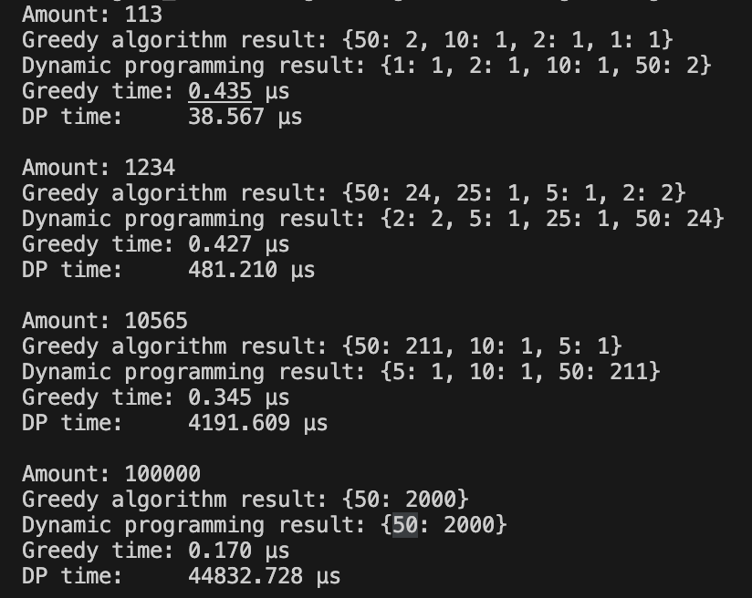

# Performance Comparison of Greedy vs Dynamic Programming Coin Change Algorithms

We tested algorithms on such values: 113, 1234, 10565, 100000. Here is a summary of the findings:

## Greedy Algorithm:

* Fastest in execution time.
* Performs well when coin denominations are canonical (i.e., work optimally with greedy logic).
* Does not guarantee the minimum number of coins for all coin systems.

## Dynamic Programming (DP) Algorithm:

* Guarantees the minimum number of coins.
* More computationally intensive, especially for large amounts.
* Takes significantly more time for larger values due to iterative processing and state storage.

## Example Results

The following screenshot shows the performance and correctness of both algorithms tested on different amounts:

## Results Summary

The comparison of the greedy algorithm and the dynamic programming (DP) approach for the coin change problem demonstrates key differences in performance and behavior:

Greedy algorithm is extremely fast and simple, performing well when the coin denominations allow for an optimal greedy strategy. For example, with denominations like [1, 2, 5, 10, 25, 50], the greedy solution often matches the optimal one.

Dynamic programming guarantees the minimal number of coins for any set of denominations, even if the greedy algorithm fails to find the best result. However, it is computationally heavier, especially for large amounts.

**From the timing results:**

* The greedy algorithm consistently executes in under 0.5 µs, making it ideal for time-critical systems.

* The DP algorithm takes significantly longer (39 – 44833 µs), but ensures optimality and flexibility.

## Conclusion:
The comparison demonstrates that the greedy algorithm consistently performs significantly faster, especially on large inputs, while still providing optimal results for canonical coin systems (like USD-style denominations). On the other hand, the dynamic programming approach, although more computationally intensive, guarantees the minimum number of coins for any coin system, including non-canonical or custom sets.

Thus, in this case, both algorithms produced the same correct results, but the greedy algorithm was noticeably more efficient in terms of execution time. This validates the efficiency of greedy strategies when the problem structure allows them to work optimally.